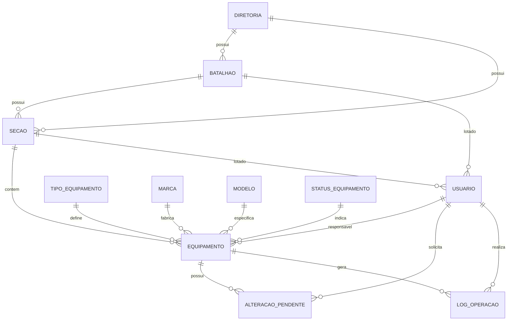

# Modelo de Banco de Dados (Prisma)

O banco de dados utiliza **PostgreSQL** e é gerenciado pelo **Prisma ORM**. A estrutura foi projetada para suportar a hierarquia organizacional da PMPE e um workflow rigoroso de aprovação de equipamentos.

## 1. Diagrama ER (Simplificado)

## 2. Tabelas Principais

### 2.1 Equipamentos (`equipamentos`)
Armazena todos os itens de hardware.
- **Campos Críticos**: `patrimonio` (Único), `secao_id`, `status_id`.
- **Flexibilidade**: O campo `dados_especificos` (JSONB) armazena atributos variáveis dependendo do tipo (ex: IMEI para celulares, Frequência para rádios).

### 2.2 Alterações Pendentes (`alteracoes_pendentes`)
Coração do workflow de aprovação.
- Quando um usuário (nível batalhão) edita um equipamento, os dados não são alterados diretamente na tabela `equipamentos`.
- Um registro é criado aqui com `dados_antigos` e `dados_novos`.
- O Comandante revisa e, se aprovado, o sistema sincroniza os dados com a tabela principal.

### 2.3 Estrutura Organizacional
- `diretorias`: Nível macro (ex: DIM, DINTER).
- `batalhoes`: Unidades operacionais.
- `secoes`: Subdivisões (onde os equipamentos residem fisicamente).

### 2.4 Usuários (`usuarios`)
- Sincronizados com a API do SEI.
- `perfil`: Define o nível de acesso (ADMIN_DTEC, COMANDANTE, USUARIO_BATALHAO).

## 3. Logs e Auditoria (`log_operacoes`)
Cada ação no sistema gera um log detalhado:
- Quem fez?
- O que fez? (Ação)
- Quando?
- De onde? (IP e User Agent)
- Dados antes/depois (em formato JSON).

---
> [!TIP]
> Para atualizar o banco após mudanças no schema, use: `npx prisma migrate dev`

