# Fluxo de Aprovação e Validação

O atlas implementa um modelo de governança onde alterações sensíveis precisam de aprovação de um superior (Comandante de Batalhão).

## 1. O Processo

1. **Solicitação**: Um usuário comum (`USUARIO_BATALHAO`) tenta editar um equipamento.
2. **Intercepção**: O sistema detecta que a alteração requer validação.
3. **Pendente**: Em vez de atualizar a tabela `equipamentos`, o sistema cria um registro em `alteracoes_pendentes`.
4. **Notificação**: O Comandante visualiza uma pendência em sua dashboard.
5. **Decisão**:
    - **Aprovar**: Os dados novos são aplicados ao equipamento original.
    - **Negar**: A alteração é descartada e o solicitante é notificado com o motivo.

## 2. Diagrama de Fluxo

```mermaid
sequenceDiagram
    participant U as Usuário Batalhão
    participant B as Backend (NestJS)
    participant C as Comandante
    participant DB as Banco de Dados

    U->>B: Tenta Editar Equipamento
    B->>DB: Registra Alteração Pendente
    B->>C: Notifica Pendência
    C->>B: Revisa e Aprova
    B->>DB: Atualiza Tabela Equipamentos
    B->>DB: Marca Pendência como Aprovada
    B->>U: Notifica Sucesso
```

## 3. Campos que Exigem Aprovação
- Status do Equipamento
- Seção de Lotação
- Responsável Direto
- Dados Críticos (IMEI, Patrimônio, Número de Série)

## 4. Endpoints Principais
- `GET /aprovacoes/pendentes` — lista pendências de aprovação da unidade.
- `GET /aprovacoes/contagem` — retorna total de pendências ativas.
- `GET /aprovacoes/:id` — obtém detalhes de uma pendência específica.
- `POST /aprovacoes/:id/decisao` — aprova ou nega uma pendência.
- `PATCH /equipamentos/:id` — atualiza equipamento; para usuários comuns cria pendência.
- `DELETE /equipamentos/:id` — exclui equipamento; para não-admin cria pendência de exclusão.

## 5. Regras atuais do workflow
- `ADMIN_DTEC` pode atualizar ou excluir direto sem pendência.
- `COMANDANTE` pode atualizar direto e processar aprovações apenas da sua unidade.
- Outros perfis criam pendência para alterações sensíveis e aguardam decisão.
- Uma pendência que já foi aprovada ou negada não pode ser processada novamente.

---
> [!IMPORTANT]
> Administradores da DTEC (`ADMIN_DTEC`) podem ignorar este fluxo e editar diretamente qualquer item.

