# Fluxo do Sistema atlas PMPE

> Navegação: [[atlas - Mapa de Conteúdo]] · [[Manual do Obsidian]] · [[Evolução do Pensamento]]

Este documento detalha o fluxo de dados e as conexões entre o frontend (Angular) e o backend (NestJS) do sistema atlas.

## 1. Arquitetura Geral

```mermaid
graph TD
    subgraph Frontend_Angular
        UI[Interface do Usuário]
        SC[Standalone Components]
        SV[Services HttpClient]
        GR[Guards / Interceptors]
    end

    subgraph Backend_NestJS
        CT[Controllers]
        MS[Modules / Services]
        PR[Prisma ORM]
        JWT[Autenticação JWT]
    end

    DB[(PostgreSQL)]

    UI --> SC
    SC --> SV
    SV --> GR
    GR --> CT
    CT --> MS
    MS --> PR
    PR --> DB
    JWT -.-> GR
```

## 2. Fluxo: Cadastro de Equipamento

```mermaid
sequenceDiagram
    participant U as Usuário
    participant F as Frontend (EquipamentosLista)
    participant S as Frontend Service
    participant B as Backend Controller
    participant D as Banco de Dados (Prisma)

    U->>F: Preenche Formulário
    F->>F: Valida Campos (Patrimônio, Tipo, etc.)
    U->>F: Clica em Salvar
    F->>S: post('/equipamentos', dados)
    S->>B: Request com Token JWT
    B->>D: prisma.equipamento.create()
    D-->>B: Equipamento Criado
    B-->>S: Response 201 Created
    S-->>F: Sucesso
    F->>U: Mostra Toast de Sucesso e Atualiza Lista
```

## 3. Fluxo Dinâmico: Carga / Descarga (Empréstimo)

O sistema monitora a disponibilidade e habilita campos específicos.

```mermaid
graph LR
    A[Selecionar Equipamento] --> B{Disponibilidade?}
    B -- Emprestado --> C[Habilitar Campos de Retorno]
    C --> D[Solicitante]
    C --> E[Data Solicitação]
    C --> F[Data Retorno Prevista]
    B -- Disponível --> G[Ocultar Campos de Retorno]
```

## 4. Conexões de Dados (Prisma Schema)

| Tabela | Função | Relação Principal |
| :--- | :--- | :--- |
| `Equipamento` | Tabela Central | `tipoEquipamentoId`, `statusId`, `secaoId` |
| `Usuario` | Gestão de Acesso | `secaoId`, `perfil` |
| `Disponibilidade`| Estado do Material | `Equipamento.disponibilidadeId` |
| `LogOperacao` | Auditoria | `equipamentoId`, `usuarioId` |

## 5. Workflow de Aprovação (Auditoria)

O sistema garante que alterações sensíveis feitas por usuários de batalhão passem por validação.

```mermaid
sequenceDiagram
    participant U as Usuário Batalhão
    participant A as AprovacoesService
    participant C as Comandante / Admin
    participant E as Equipamento (Tabela)

    U->>A: Solicita Alteração (dados novos)
    A->>A: Salva em 'AlteracaoPendente'
    C->>A: Lista Pendências
    C->>A: Processar Decisão (Aprovar/Negar)
    alt Aprovado
        A->>E: Aplica 'dadosNovos' no Equipamento
    else Negado
        A->>A: Marca como reprovado + Motivo
    end
```

## 6. Dashboard Analítico

O dashboard consome o endpoint `/dashboard/estatisticas` que consolida:
1. **Contagem por Status** (Ativo, Inativo, Manutenção)
2. **Contagem por Tipo** (Rádio, CPU, Monitor)
3. **Distribuição por Batalhão** (Soma de equipamentos em todas as seções do batalhão)
4. **Resumo Executivo** (Cards de topo)

## 7. Relatórios e Auditoria

O sistema permite a rastreabilidade total das operações.

```mermaid
graph TD
    A[Usuário] --> B{Relatórios}
    B --> C[Inventário Geral]
    B --> D[Auditoria de Operações]
    C --> E[Filtros: Seção/Tipo]
    E --> F[Exportar CSV]
    D --> G[Logs: Quem/Quando/O que]
```

| Operação | Descrição |
| :--- | :--- |
| `CREATE` | Novo material inserido no sistema |
| `UPDATE` | Alteração de dados cadastrais ou estado |
| `DELETE` | Remoção de material do inventário |

### 7.1. Detalhamento de Alterações (Diff)
O sistema captura o "Antes" e "Depois" de cada campo alterado, armazenando em formato JSON para auditoria retroativa.

```mermaid
graph TD
    A[Usuário/Admin] --> B{Operação}
    B -- Update --> C[Gerar Diff]
    C --> D[Salvar LogOperacao]
    D --> E[Visualização no Relatório]
```

## 8. Gestão Visual (Fotos)

O sistema permite anexar múltiplas fotos a cada equipamento:
- **Upload:** Armazenamento local no servidor via Multer.
- **Visualização:** Miniaturas na listagem principal e grade de fotos no detalhamento.
- **Formatos:** Suporte a JPG e PNG com limite de 5MB por arquivo.

## 9. Documentação Legal (Cautela)

O sistema gera automaticamente o Termo de Responsabilidade (PDF).

```mermaid
graph LR
    A[Registro de Saída] --> B[Gerar PDF]
    B --> C[Dados Equipamento]
    B --> D[Termo de Responsabilidade]
    B --> E[Campos de Assinatura]
    E --> F[Impressão e Assinatura Física]
```

---
*Documentação gerada automaticamente para visualização no Obsidian.*

