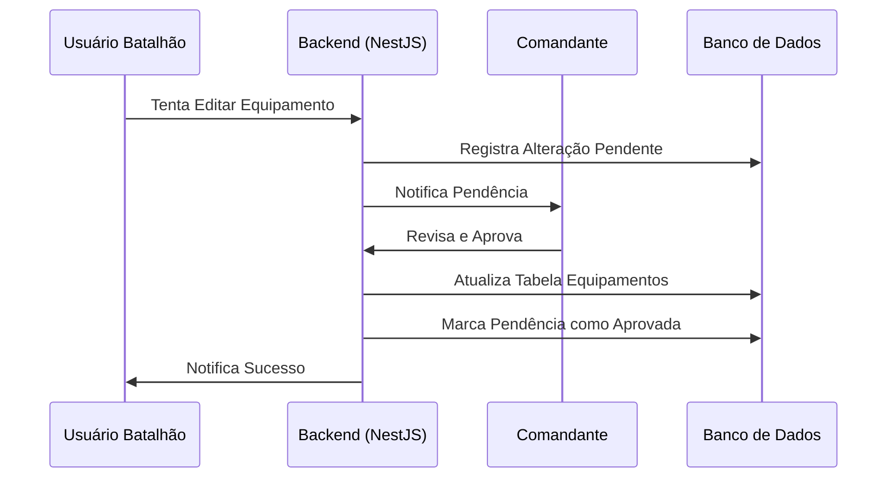

# Fluxo de Aprovação e Validação

O SIGMAT implementa um modelo de governança onde alterações sensíveis precisam de aprovação de um superior (Comandante de Batalhão).

## 1. O Processo

1. **Solicitação**: Um usuário comum (`USUARIO_BATALHAO`) tenta editar um equipamento.
2. **Intercepção**: O sistema detecta que a alteração requer validação.
3. **Pendente**: Em vez de atualizar a tabela `equipamentos`, o sistema cria um registro em `alteracoes_pendentes`.
4. **Notificação**: O Comandante visualiza uma pendência em sua dashboard.
5. **Decisão**:
    - **Aprovar**: Os dados novos são aplicados ao equipamento original.
    - **Negar**: A alteração é descartada e o solicitante é notificado com o motivo.

## 2. Diagrama de Fluxo

## 3. Campos que Exigem Aprovação
- Status do Equipamento
- Seção de Lotação
- Responsável Direto
- Dados Críticos (IMEI, Patrimônio, Número de Série)

---
> [!IMPORTANT]
> Administradores da DTEC (`ADMIN_DTEC`) podem ignorar este fluxo e editar diretamente qualquer item.

