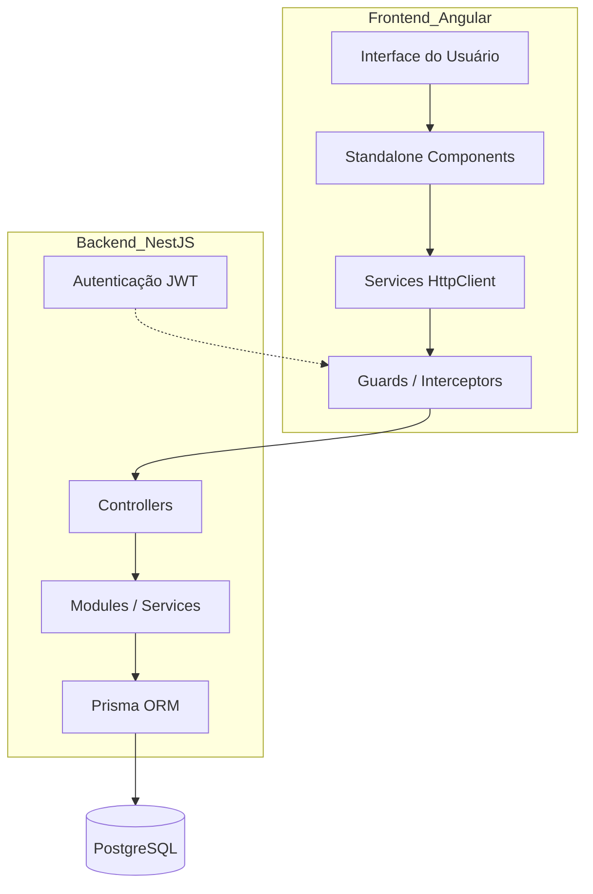
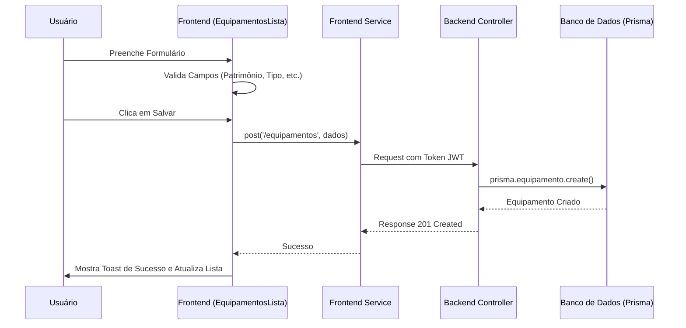
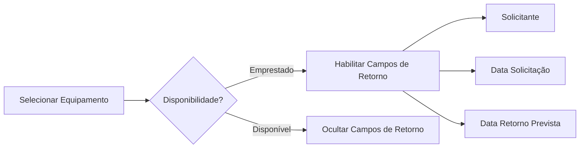
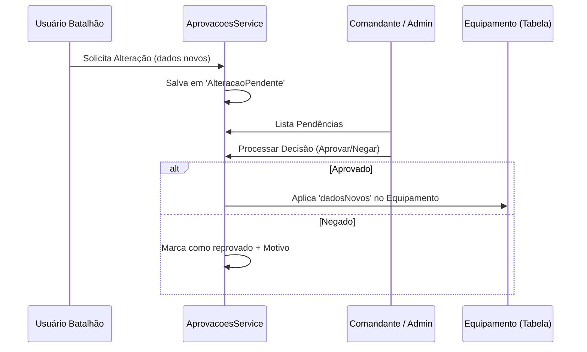
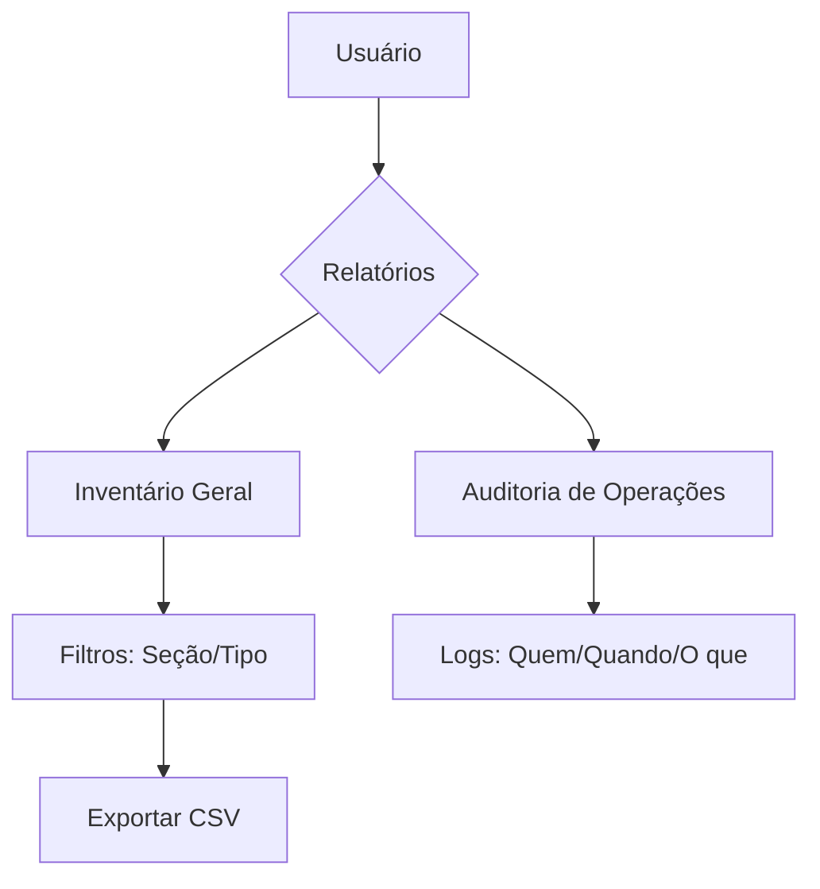
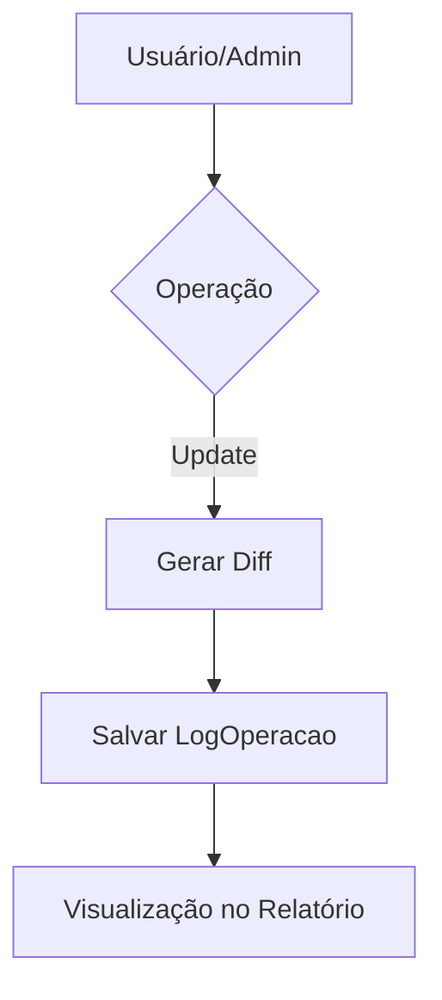
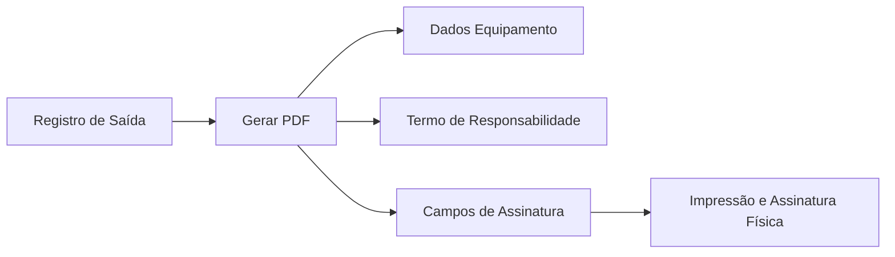

# Fluxo do Sistema SIGMAT PMPE

> Navegação: [[SIGMAT - Mapa de Conteúdo]] · [[Manual do Obsidian]] · [[Evolução do Pensamento]]

Este documento detalha o fluxo de dados e as conexões entre o frontend (Angular) e o backend (NestJS) do sistema SIGMAT.

## 1. Arquitetura Geral

## 2. Fluxo: Cadastro de Equipamento

## 3. Fluxo Dinâmico: Carga / Descarga (Empréstimo)

O sistema monitora a disponibilidade e habilita campos específicos.

## 4. Conexões de Dados (Prisma Schema)

| Tabela | Função | Relação Principal |
| :--- | :--- | :--- |
| `Equipamento` | Tabela Central | `tipoEquipamentoId`, `statusId`, `secaoId` |
| `Usuario` | Gestão de Acesso | `secaoId`, `perfil` |
| `Disponibilidade`| Estado do Material | `Equipamento.disponibilidadeId` |
| `LogOperacao` | Auditoria | `equipamentoId`, `usuarioId` |

## 5. Workflow de Aprovação (Auditoria)

O sistema garante que alterações sensíveis feitas por usuários de batalhão passem por validação.

## 6. Dashboard Analítico

O dashboard consome o endpoint `/dashboard/estatisticas` que consolida:
1. **Contagem por Status** (Ativo, Inativo, Manutenção)
2. **Contagem por Tipo** (Rádio, CPU, Monitor)
3. **Distribuição por Batalhão** (Soma de equipamentos em todas as seções do batalhão)
4. **Resumo Executivo** (Cards de topo)

## 7. Relatórios e Auditoria

O sistema permite a rastreabilidade total das operações.

| Operação | Descrição |
| :--- | :--- |
| `CREATE` | Novo material inserido no sistema |
| `UPDATE` | Alteração de dados cadastrais ou estado |
| `DELETE` | Remoção de material do inventário |

### 7.1. Detalhamento de Alterações (Diff)
O sistema captura o "Antes" e "Depois" de cada campo alterado, armazenando em formato JSON para auditoria retroativa.

## 8. Gestão Visual (Fotos)

O sistema permite anexar múltiplas fotos a cada equipamento:
- **Upload:** Armazenamento local no servidor via Multer.
- **Visualização:** Miniaturas na listagem principal e grade de fotos no detalhamento.
- **Formatos:** Suporte a JPG e PNG com limite de 5MB por arquivo.

## 9. Documentação Legal (Cautela)

O sistema gera automaticamente o Termo de Responsabilidade (PDF).

---
*Documentação gerada automaticamente para visualização no Obsidian.*

